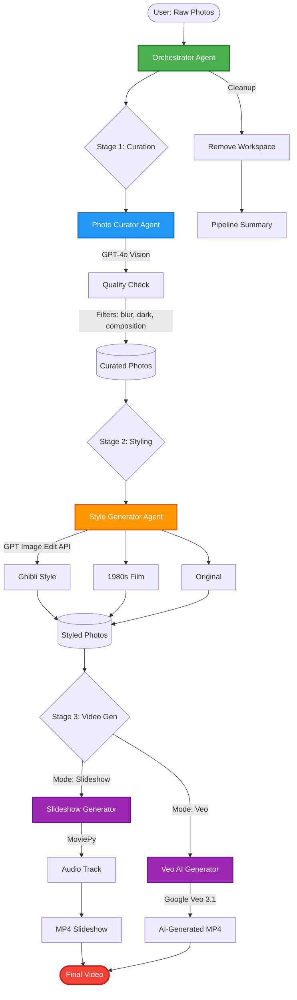
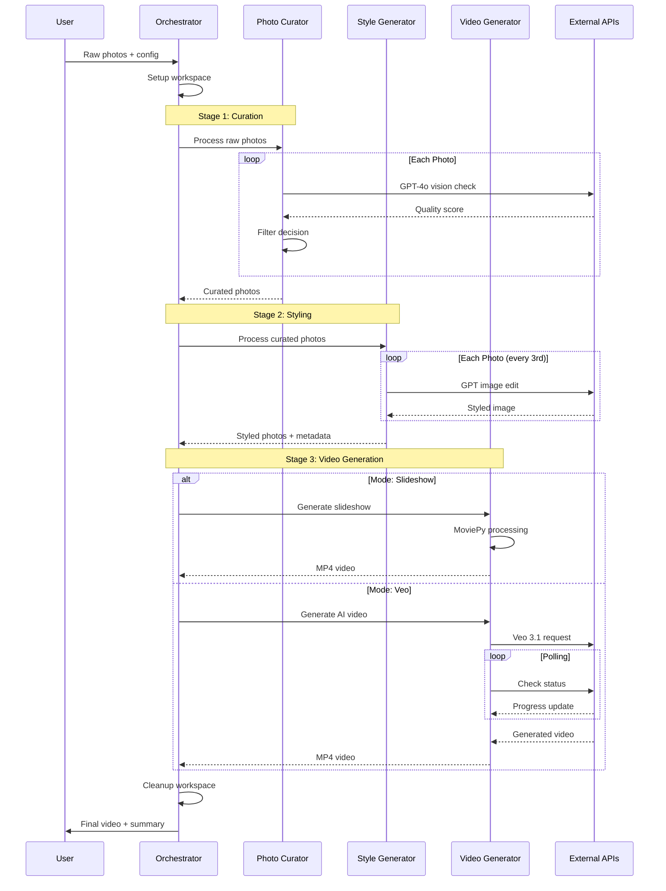
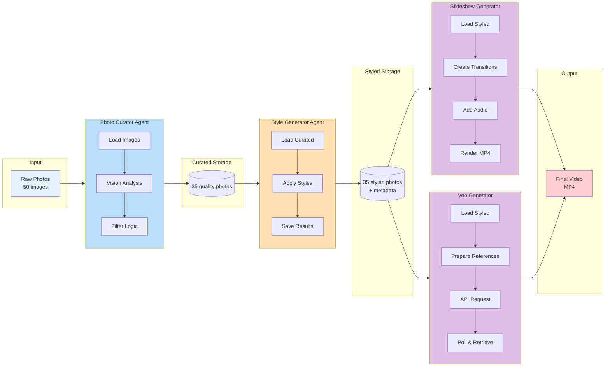
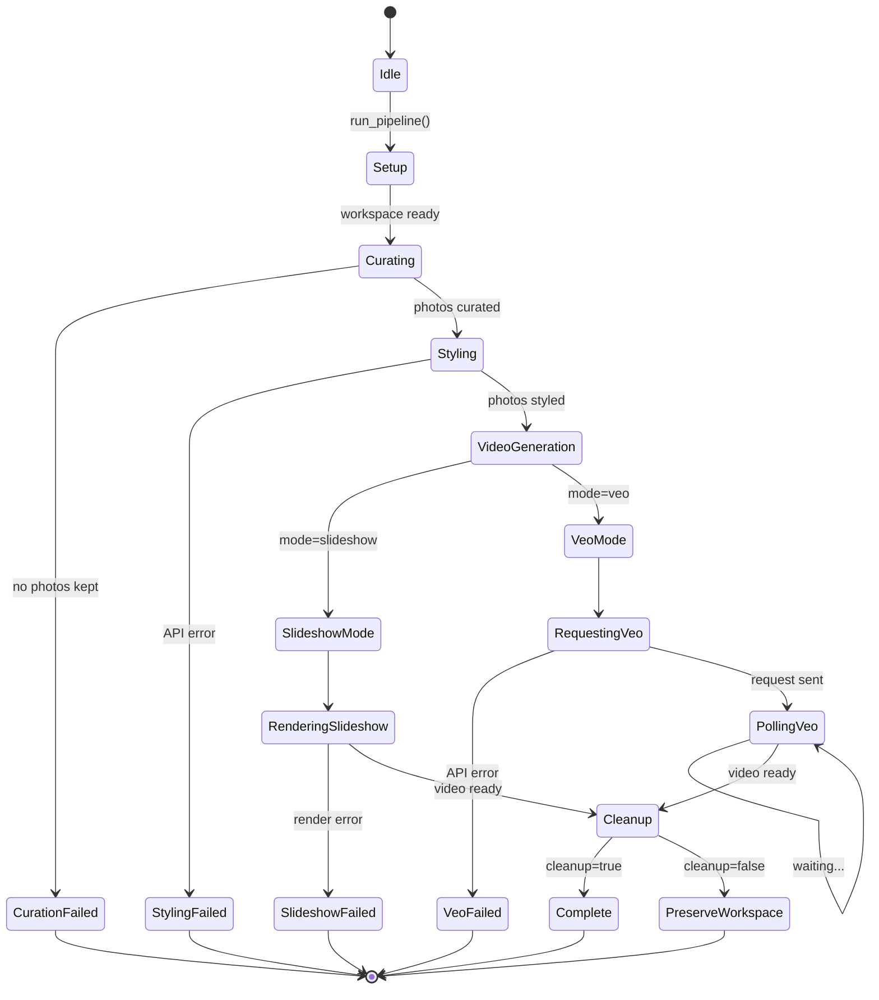
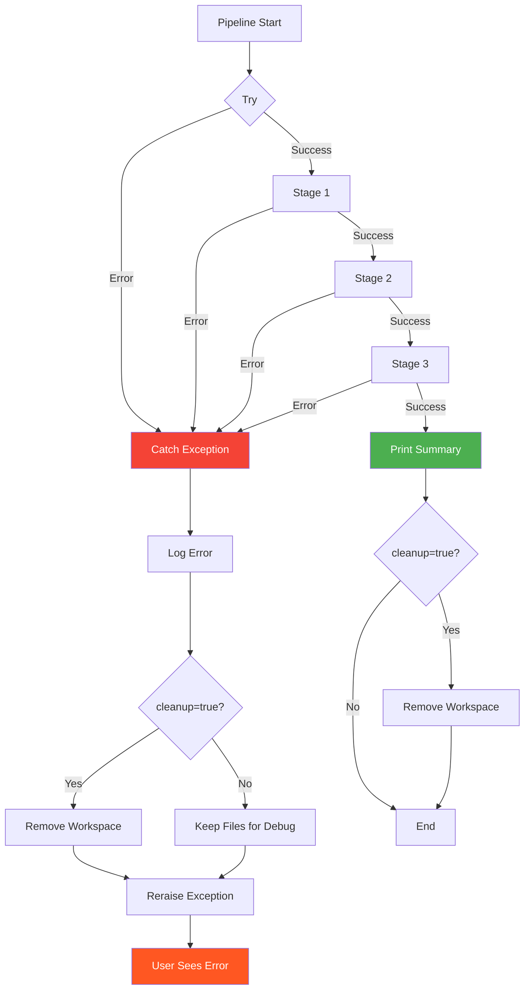

# Orchestrator Architecture

## System Flow Diagram

## Agent Communication Pattern

## Data Flow Architecture

## State Machine

## Component Responsibilities

| Component | Responsibility | Input | Output | External Deps |
|-----------|---------------|-------|--------|---------------|
| **Orchestrator** | Pipeline coordination, error handling, workspace management | Raw photos, config | Final video, stats | None |
| **Photo Curator** | Quality filtering using vision AI | Raw photos | Curated photos | OpenAI GPT-4o |
| **Style Generator** | Artistic style application | Curated photos | Styled photos | OpenAI Image API |
| **Slideshow Generator** | Traditional video creation | Styled photos, audio | MP4 video | MoviePy, ffmpeg |
| **Veo Generator** | AI-powered video generation | Styled photos, prompt | MP4 video | Google Veo 3.1 |

## Error Handling Flow

